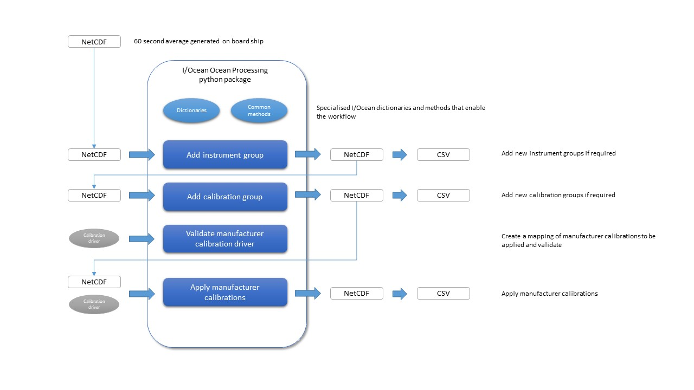

Current workflow
================

The package has been developed to work with the `I/Ocean NetCDF specification`_. It is used to process ocean 
data to internal and international standards, returning NetCDF and CSV formats.

.. _I/Ocean NetCDF specification: https://github.com/I-Ocean/netcdf-specification